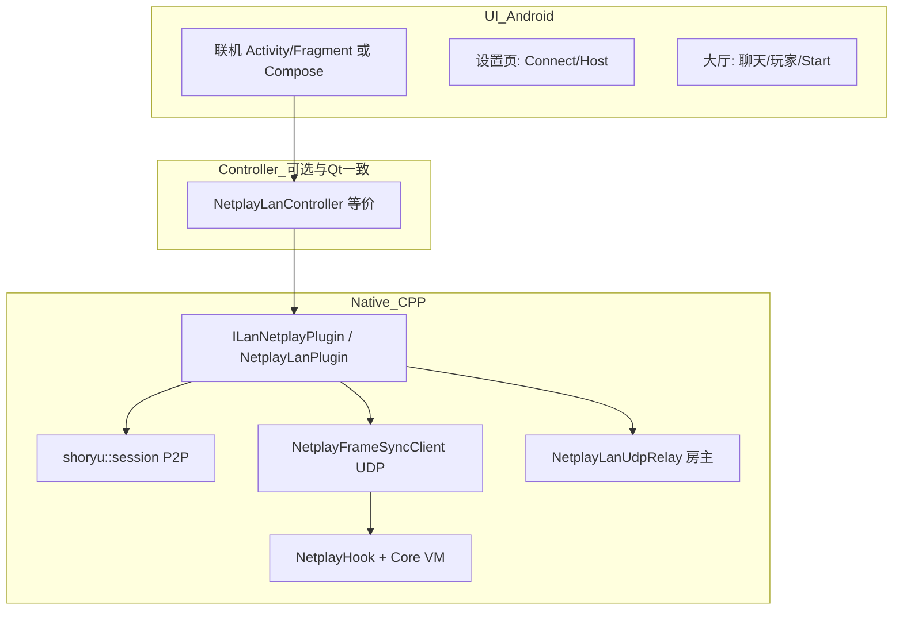

# EmuCoreX 局域网联机模块移植说明（对照 PCSX2-Qt）

本文档基于仓库 **`D:\PS2\pcsx2`** 中已实现 **局域网联机（LAN Boot Netplay）** 的代码与 **`D:\PS2\pcsx2\版本迁移.md`**、**`D:\PS2\pcsx2\docs\联机模块分析.md`** 的架构说明，面向 **EmuCoreX（Android）** 开发团队：**在保持与 PC 版相同协议与状态机的前提下**，将 UI 迁移到 Jetpack Compose，并将核心逻辑以 **同一套 C++ 源码**（或 JNI 封装）集成到原生层。

---

## 1. 目标与范围

| 目标 | 说明 |
|------|------|
| **功能对等** | 与 PCSX2-Qt 局域网联机一致：shoryu P2P 信令、大厅聊天、玩家列表、输入延迟、房主选游戏启动、成员接收 `PS2LAN_V3` 会话同步、金手指同步、`NetplayFrameSyncClient` UDP 帧同步、`NetplayLanUdpRelay`（房主无云端 UDP 时的合并广播中继）。 |
| **跨端联机** | Android ↔ PC 使用 **相同 UDP 协议与端口约定**（见下文）、相同 `room_id` / `player_id` 字段语义、相同聊天前缀信令（`PS2LAN_*`）。 |
| **UI 对标** | 先 **Connect / Host 双页签 + 参数表单**，用户确认后进入 **大厅（聊天 + 玩家表 + 状态 + Start）**；交互顺序与 Qt 版一致。 |

**不在本文档逐行展开的**：Quick Join（HTTP 房间服务）与 **Verifier** 仅作参考；若 Android 仅做 LAN，可复用同一套 `NetplayFrameSyncClient` 与 `NetplayHook`，但 **不强制** 打开 Quick Join UI。

---

## 2. PC 端入口与工程位置（必读路径）

| 角色 | 路径 |
|------|------|
| **菜单入口** | `pcsx2/pcsx2-qt/MainWindow.cpp`：`onNetplayLanTriggered()` → `NetplayLanController::GetInstance().StartLanNetplay(this)` |
| **控制器（单例）** | `pcsx2/pcsx2-qt/Netplay/NetplayLanController.{h,cpp}`：创建对话框、连接 `EmuThread::onVMStarted/onVMStopped`、填充 `g_NetplayRoomState`、处理 `PS2LAN_*` 协议 |
| **Qt 对话框 UI** | `pcsx2/pcsx2-qt/Netplay/NetplayLanDialog.{h,cpp}`：`QStackedWidget` 切换 **设置页 / 大厅页**；`TabWidget` **Connect / Host** |
| **设置结构** | `pcsx2/pcsx2-qt/Netplay/NetplayLanSettings.{h,cpp}`：`g_LanNetplaySettings` |
| **房间/帧同步全局状态** | `pcsx2/pcsx2-qt/Netplay/NetplayRoomState.h`：`g_NetplayRoomState` |
| **插件实现** | `pcsx2/pcsx2-qt/Netplay/NetplayLanPlugin.cpp`：`ILanNetplayPlugin`：`Open` / `BeginLanLobbySession` / `BeginLanBootSession` / `Host()` / `Join()` / `EndSession` |
| **P2P 会话（shoryu）** | `pcsx2/pcsx2-qt/Netplay/shoryu/session.h`（模板头）、`shoryu/zed_net.cpp` |
| **UDP 帧同步** | `pcsx2/pcsx2-qt/Netplay/NetplayFrameSyncClient.{h,cpp}` |
| **房主 UDP 中继（无云端合并服务时）** | `pcsx2/pcsx2-qt/Netplay/NetplayLanUdpRelay.{h,cpp}` |
| **核心钩子** | `pcsx2/pcsx2/NetplayHook.{h,cpp}`：`ApplyFrameSyncInputHooks`、`SetVSyncCallback`、`SetLanBootVsyncCallback`、`SetLanExclusiveLocalPadSlot` 等；与 `pcsx2/pcsx2/Counters.cpp` 中 `VSyncStart` 内调用顺序绑定 |
| **CPU 线程轮询** | `pcsx2/pcsx2/VMManager.cpp`：`PollInputOnCPUThread()`（`InputManager::PollSources` → 可选独占槽清零 → 可选 `LanCpuFrameCallback`） |

**CMake 中 LAN 相关源文件列表**（便于 Android 侧对齐同一文件集）：见 `pcsx2/pcsx2-qt/CMakeLists.txt` 中 `Netplay/` 段（含 `NetplayFrameSyncInputHooks.*`、`NetplayLan*`、`shoryu/zed_net.cpp` 等）。

**背景说明（Wx → Qt → Android）**：`pcsx2/版本迁移.md` 描述旧版 **Boot Netplay** 与 **shoryu / NetplayFrameSync / IOPHook** 的分层；当前 Qt 树中 **LAN 不依赖 IOPHook.cpp**（旧版 `pcsx2-online` 的 `IOPHook` 在 `D:\PS2\pcsx2-online\pcsx2\Netplay\IOPHook.cpp`），**输入以 `NetplayFrameSyncClient::OnVSync` + `NetplayHook` 为主**。

---

## 3. 分层架构（移植时勿打散）

- **UI 层**：只负责展示与主线程投递；**禁止**在业务线程直接改界面。
- **控制器层**：与 Qt 版一致：在「用户点 Host/Connect」后写入 `g_LanNetplaySettings` / `g_NetplayRoomState`，再调 `BeginLanLobbySession`。
- **插件层**：绑定 UDP、启动帧同步、Host/Join 线程、`WaitForConfirmation` / `wait_for_start` 等与 Qt 相同。

---

## 4. Qt 版 UI 与状态机（Android 应对照实现）

### 4.1 设置页（`NetplayLanDialog::createSettingsPanel`）

- **标题区**：Username、`SaveReplay` 勾选。
- **Tab**：**Connect** | **Host**（与截图一致）。
- **Connect 页**：Host Address（文本）、Host Port（默认与 `7500` 等一致）、**Connect** 按钮。
- **Host 页**：Listen Port、说明文字（成员 **Host Port** 须与房主 **Listen Port** 一致）、Players 固定为 2（只读）、`Client-Only Delay` / `Memory Card Sync` / `Read-Only Memory Card` 等勾选、**Host** 按钮。
- **底部**：Cancel。

### 4.2 大厅页（`createLobbyPanel`）

- **状态**：`SetStatus` 文案（如「等待连接」「已连接，等待房主开始」等）。
- **聊天**：`QTextEdit` 展示 + 输入框 + 发送；`AddChatMessage` / `SendOutgoingChatMessage`。
- **玩家表**：`QTableWidget` 列：序号、名称、Ping；`SetUserlist`。
- **房主**：`Input Delay` 可调、`Start` 可点；**成员**：Start 禁用（见 `doOnConnectionEstablished`）。

### 4.3 阶段切换（`NetplayLanDialog`）

| 方法 | 说明 |
|------|------|
| `PresentLobbyAfterHostOrConnect()` | 用户点 Host/Connect 后主线程 **立即** 切到大厅（不等待插件线程） |
| `SwitchToSettings()` / `SwitchToLobby()` | `QStackedWidget` 切换 |
| `OnConnectionEstablished(delay)` | 进入大厅后，根据 Host/Guest 启用/禁用 Start 与延迟 |
| `WaitForConfirmation()` | 房主在大厅点 Start 后，**阻塞** 等待 `m_confirm_cond`（直到 `Start` 成功或取消） |

Android 建议：**设置页** 与 **大厅** 用 `NavHost` 两页，或单 Activity 内 `AnimatedVisibility` / 两个 Composable 等价于 `QStackedWidget`。

---

## 5. 控制器逻辑要点（`NetplayLanController`）

### 5.1 启动流程

1. `StartLanNetplay`：创建对话框、`SetConnectionSettingsHandler` → `onConnectionSettingsReady`。
2. **`onConnectionSettingsReady`**（用户从设置页点击 Connect/Host 后）：
   - `g_LanNetplaySettings = GetSettings()`；`IsEnabled = true`；**`LobbyPhaseOnly = true`**（先仅大厅，无 VM）。
   - 填充 **`g_NetplayRoomState`**（与 Qt 一致：`room_id = "LAN"`、`player_id = Username`、`is_host`、`udp_server_port`（默认 `38889`）、`udp_server_addr`（房主常用 `127.0.0.1` 本机自环；成员填 **房主局域网 IP**）、`sync_delay` 以当前 Qt 实现为准（见源码 `NetplayLanController.cpp`）等）。
   - `PresentLobbyAfterHostOrConnect()`。
   - **`ILanNetplayPlugin::GetInstance().BeginLanLobbySession(m_dialog)`** → 内部 `Open()` 建 shoryu、绑定端口、**不** 起 VM。

### 5.2 VM 生命周期（与 Qt 一致）

- `EmuThread::onVMStarted`：若 `LobbyPhaseOnly` 为 true，则 `ShutdownLanBootSession` 清大厅-only 会话，再 **`BeginLanBootSession`**（完整 Boot + 帧同步钩子）。
- `onVMStopped`：若联机仍启用且已 Hook IOP，则 **`ShutdownLanBootSession`**。

Android 需在同一生命周期点调用 **同名** 原生接口（或封装后的 `nativeLanOnVmStarted()` / `nativeLanOnVmStopped()`）。

### 5.3 跨端会话同步（成员）

- 房主通过聊天发送 **`PS2LAN_V3`** 分片（Base64+压缩 JSON），内容含 **CRC、序列号、金手指文件列表** 等；成员 `guestProcessV3Line` 拼齐后 `guestApplySessionPayload`，**选 ISO**、**校验 CRC**、**金手指暂存/覆盖** 后与房主一致再启动。

### 5.4 其他信令

- `PS2LAN_ACK`：房主等待成员就绪（`QSemaphore`）。
- `PS2LAN_MINIMIZE_LOBBY`：最小化大厅等。

---

## 6. 插件侧关键行为（`NetplayLanPlugin`）

| 阶段 | 行为摘要 |
|------|----------|
| **`BeginLanLobbySession`** | `LobbyPhaseOnly`；占位 `EmulatorSyncState`；`Open()` 仅 shoryu 大厅；**不** 起 `NetplayFrameSyncClient` 的 Boot 帧同步分支（见 `Open()` 内 `bootUsesFsync`） |
| **`BeginLanBootSession`** | `HookLanIOP`；`Init()`；`SetLanBootVsyncCallback`；**`LanCpuFrameCallback`** 在帧同步路径应保持 **null**（与 Quick Join 一致，避免双路径读键）；`Open()` 里 **`bootUsesFsync`** 为真时：`NetplayFrameSyncClient::Start(g_NetplayRoomState)`、**房主** `NetplayLanUdpRelay::Start(udp_server_port, ...)`、`ApplyFrameSyncInputHooks` 等 |
| **`Host()` / `Join()`** | 独立线程：`create` / `join`、同步状态校验、`wait_for_start`、设置 `Game started` 等状态 |

**输入路径**：以 **`NetplayFrameSyncClient::OnVSync`**（经 `NetplayHook::SetVSyncCallback`）为主；**不要** 在帧同步模式下同时走旧式 `OnCpuPollFrame` → `HandleIO` 轮询（与 PC 修复方向一致）。

---

## 7. 全局与端口约定（跨端必须一致）

| 字段 | 说明 |
|------|------|
| **shoryu** | 成员 **Connect** 的 **Host Port** = 房主 **Listen Port**（同一 UDP 端口） |
| **帧同步 UDP** | `g_NetplayRoomState.udp_server_port`（默认 `38889`）；**无云端 UDP 服务** 时房主 **`NetplayLanUdpRelay`** 在该端口收 `0x0001` 并广播 `0x0002`（与 `NetplayFrameSyncClient::ParseBroadcastPacket` 一致） |
| **成员 `udp_server_addr`** | 填 **房主可达 IP**（局域网 IP；非 `127.0.0.1` 除非本机双开） |
| **防火墙** | 双方放行 **Listen/Host Port** 与 **udp_server_port** 的 UDP |

---

## 8. EmuCoreX 仓库当前落地进度（实勘，实事求是）

本节基于 **`D:\PS2\EmuCoreX`** 源码树检索与关键文件阅读，描述**已落地**与**仍缺口**的工作，避免与「计划/建议」混淆。

### 8.1 已具备（原生 + JNI + Kotlin 基础）

- **C++ 联机核心**：`Netplay/NetplayLanPlugin.cpp`、`NetplayFrameSyncClient`、`NetplayLanUdpRelay`、`NetplayUdpSocket`、`NetplayFrameSyncInputHooks`、`shoryu/session.h`、`NetplayLanAndroidController`、`platform/android_bridge/AndroidLanBridge.cpp` 等已随 Android 目标参与编译链接；构建时曾因缺少 `NetplayUdpSocket.cpp` 出现链接符号缺失，**已在 `app/src/main/cpp/pcsx2/CMakeLists.txt` 的 Android 源列表中补齐**，Release APK 可成功打出（以当前仓库为准）。
- **JNI / Kotlin**：包路径 **`com.sbro.emucorex.netplay`** 下已有 **`LanNetplayRepository`、`LanNetplayNative`、`LanNetplayModels`**；**`NativeApp.kt`** 中声明了 **`lanRegisterCallback`、`lanStartSession`、`lanOnVmStarted`** 等与原生会话相关的 JNI——即**功能层与 JNI 入口已铺好**，不等于业务流程已在 App 内完整接线。

### 8.2 与 PCSX2-Qt 的关键差异（须写入排期）

- **`NetplayHook` 在 Android 为存根**：`pcsx2/NetplayHook.h` 中 **`ApplyFrameSyncInputHooks`、`SetVSyncCallback` 等均为空实现**（注释写明由「EmuThread / 平台钩子」承担）。**当前仓库内**除 `NetplayFrameSyncInputHooks.cpp` 通过 **`NetplayHook::ApplyFrameSyncInputHooks`** 注册回调外，**未检索到**在核心循环（例如与 PC 端 `Counters` / VSync 等价路径）中对 **`g_NetplayFrameSync->OnVSync()`** 的显式调用。  
  **结论**：在补上与 PC **`NetplayHook` + `Counters::VSyncStart`** 等价的驱动之前，**Boot 帧同步（依赖 `NetplayFrameSyncClient::OnVSync`）在 Android 上很可能仍未真正跑起来**；这是「只移植了源码与 JNI」与「可玩联机」之间的**硬门槛**。
- **UI 层**：**未**在 **`AdaptiveShell` / `AppNavigation`** 中检索到与文档此前建议一致的 **「联机」侧栏入口** 及 **`LanNetplayScreen`（Connect/Host + 大厅）** 的完整 Compose 落地；当前更接近 **能力在库里、主流程未接上**。
- **VM 生命周期**：**`LanNetplayRepository.notifyVmStarted()` / `notifyVmStopped()`** 与 Qt 侧 **`EmuThread::onVMStarted` / `onVMStopped`** 对应，须在模拟器启动/停止处调用；**`ui/emulation` 等路径下当前未见引用**，**大概率未接线**——会导致「大厅阶段」与「Boot 阶段」切换与 PC 不一致。

### 8.3 开发团队下一步落地（建议优先级）

1. **阻塞级：帧同步主循环** — 审阅 Android 核心线程 VSync 出口，**实现其一**：实现非存根的 `NetplayHook` 绑定（对齐 PC `NetplayHook.cpp` + `Counters` 调用关系），或在单一、明确的 VSync 点调用 `g_NetplayFrameSync->OnVSync()`（并避免与旧 `HandleIO` 双路径读键）。**未完成则谈不上与 PC 跨端帧同步对齐。**
2. **VM 回调** — 在 **VM 启动成功 / 停止** 的统一位置调用 JNI/Repository 的 **`lanOnVmStarted` / `lanOnVmStopped`（或封装）**，对齐 **`BeginLanBootSession` / `ShutdownLanBootSession`** 的 Qt 行为。
3. **Compose 与导航** — 侧栏 **「联机」** → **Connect/Host + 大厅**，与 **`LanNetplayRepository`** 状态、聊天与玩家列表回调对齐。
4. **联调回归** — 同一局域网内 Android ↔ PC、**Listen/Host Port** 与 **`udp_server_port`（如 38889）**、**PS2LAN_V3 / ACK**、房主 1P / 成员 2P 等按验收清单逐项验证。

---

## 9. EmuCoreX（Android）集成位置建议

### 9.1 侧栏「应用程式」区块

当前工程（`D:\PS2\EmuCoreX`）侧栏在 **`AdaptiveShell.kt`** 的 **`SideNavigation`** 中，**`stringResource(R.string.shell_app_section)`**（与截图「应用程式」对应）**下方** 已有：应用程式设定、游戏管理器、重设所有设定、资料传输等。

**建议**：在同一 **Column** 内、`navigateDataTransfer` 之后增加一项 **「联机」**（字符串资源 `shell_netplay` 或 `netplay_lan`），图标可用 `Icons.Rounded.Wifi` / `Icons.Rounded.Cloud` 等，样式与 **`ShellAction`** 一致。

**导航**：在 **`AppNavigation.kt`** 增加对应 **destination** 或 **子图**，打开 **新 Screen**（如 `LanNetplayScreen` / `NetplayLanRoute`）。

### 9.2 UI 技术栈

- 与现有 **Compose** 一致：`TabRow` + `HorizontalPager` 或两个 Tab 对应 **Connect / Host**；第二页为 **大厅**（`LazyColumn` 聊天 + `Table`/`Row` 玩家列表）。

### 9.3 与原生模拟器通信

- **推荐**：将 **`pcsx2-qt/Netplay`** 下与 UI 无关的 C++ **整编进 Android 原生库**，通过 **JNI** 暴露：`beginLanLobbySession` / `beginLanBootSession` / `endSession` / `sendChat` / `getSettings` 等；**UI 层** 仅调用 JNI，**逻辑** 与 PC **同源**。
- 若短期无法合并全部 C++，至少需 **协议兼容**：shoryu 与 `NetplayFrameSyncClient` 的 UDP 包格式 **不可** 与 PC 分叉。

---

## 10. 参考文档索引（`D:\PS2\pcsx2` 内）

| 文档 | 内容 |
|------|------|
| **`版本迁移.md`** | Boot Netplay 分层、Wx→Qt 迁移、`g_NetplayRoomState` 与纯 LAN 字段说明 |
| **`docs/联机模块分析.md`** | 帧同步、UDP、与 Android 联调注意点（性能、广播冗余等） |

---

## 11. 验收清单（建议）

- [ ] 侧栏「应用程式」下可进入联机，**Connect/Host 两页签** 与 **大厅** 流程与 Qt 一致。  
- [ ] 成员 **Host Port** 与房主 **Listen Port** 一致时可入房；聊天与玩家列表与 PC 互通。  
- [ ] 房主选 ISO 启动后，成员能收到 **PS2LAN_V3** 并完成 CRC/金手指对齐。  
- [ ] 游戏内 **1P 房主 / 2P 成员** 与 `NetplayFrameSyncClient::OnVSync` + `NetplayHook` 行为一致，无双重输入路径。  
- [ ] 与 PC 同一局域网 **跨端** 可连（UDP 端口与 IP 配置正确）。  

---

## 12. 修订记录

| 日期 | 说明 |
|------|------|
| 2026-04-20 | 初版：根据 `D:\PS2\pcsx2` 源码与 EmuCoreX `AdaptiveShell` 结构整理 |
| 2026-04-20 | 增补 **§8 仓库实勘**：已落地的原生/JNI/Repository；明确 **Android `NetplayHook` 存根与 `OnVSync` 未接线风险**；UI 与 VM 生命周期待接；章节顺延为 §9–§12；更新 **下一步落地优先级** |
